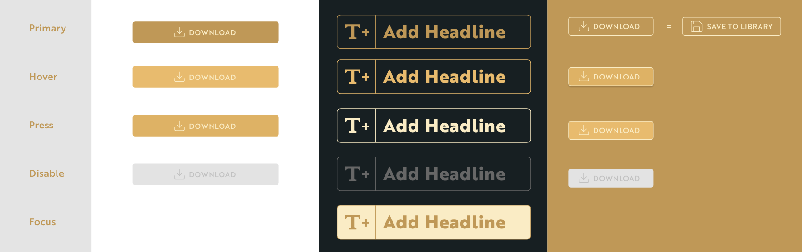

This assignment was created with [Create React App](https://github.com/facebook/create-react-app) and [Storybook](https://storybook.js.org/).

Consider checking [storybook documentation](https://storybook.js.org/docs/basics/introduction/) and [guides](https://www.learnstorybook.com/) before starting the assignment.

# Assignment

This assignment consists of 2 parts:
* implementing a simple react button component
* and an arch transformation for a svg path/group.

## Part 1. `Button` react component 

Implement `Button` component and stories that showcase its different states.

Requirements provided below are just a guidance, feel free to rename/add/remove properties and create separate components (e.g. `IconButton`) as you see fit.

Button component may have following properties:

- `text` what's the text on the button
- `subtext` some buttons have secondary text on them
- `icon` most buttons have an icon
- `type` what type of a button is that (e.g. `icon`, `medium`, `large`)
- `disabled` (default: false) if the component is disabled
- `active` if the button is in the active state (see big yellow button in the design)

Try to consider all edge cases.

### Requirements

The assignment should be completed in JavaScript using React. Each component should have stories that reflect different states of the component. Try to make the component look as close to the given [design](.resources/Sliders_Buttons_List.xd) as possible. Please use the provided [font](.resources/Brother.1816-font.zip).

### Resources

- [XD Design file](.resources/Sliders_Buttons_List.xd)
- [Brother1816 font](.resources/Brother.1816-font.zip)

### PLEASE NOTE

[Adobe XD](https://www.adobe.com/products/xd.html) is a **FREE** program that you can use to open the design file provided above (you'll need to create an Adobe account if you don't have one).

### Extra

Make styles as reusable as possible, consider making global variables (like colors, sizes, etc.).

## Part 2. Arch transformation

Implement Arch transformation for the [provided SVG file](.resources/sampleText.svg).

### Requirements

Implement a simple ui with the SVG image and a slider beneath to control the strength of the Arch effect (like on the image above).

You can create it as a react component with a story, that demonstrates how it works.

### Useful links

#### [paper.js](http://paperjs.org)
#### [warpjs](https://github.com/benjamminf/warpjs)

Check [this example](https://codepen.io/benjamminf/pen/NpZLeb) for warpjs. Problem with this library is that it's working *only* in the browser environment.

## Important Scripts

In the project directory, you can run:

### `yarn` or `npm i`

to install dependencies, (you'll need [yarn](https://yarnpkg.com/) installed). Feel free to use `npm` instead of `yarn` if you wish.

### `yarn start` or `npm start`

Will run storybook on your computer

Open [http://localhost:6006](http://localhost:6006) to view it in the browser.

The page will reload if you make edits.

## Other Scripts

### `yarn test` or `npm test`

Launches the test runner in the interactive watch mode. 
See the section about [running tests](https://facebook.github.io/create-react-app/docs/running-tests) and this [storybook guide](https://www.learnstorybook.com/intro-to-storybook/react/en/test/) about testing UI components for more information.

